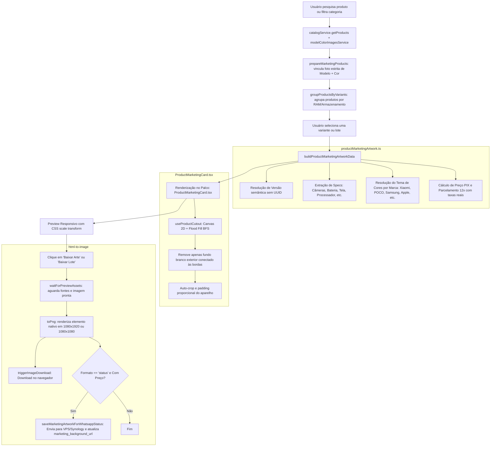

# Estrutura Completa e Arquitetura do Gerador de Artes (Mercado do Vale)

Este documento descreve detalhadamente o funcionamento, arquitetura, fluxo de dados, motor de renderização, regras de negócio e componentes do módulo **Gerador de Artes** do sistema Mercado do Vale.

---

## 1. Visão Geral do Módulo

O **Gerador de Artes** (anteriormente chamado de *Studio de Criativos*) é a ferramenta responsável por gerar automaticamente peças publicitárias de alto padrão visual (Stories, Feed do Instagram e Figurinhas para WhatsApp) diretamente a partir do cadastro de produtos do sistema, sem necessidade de softwares externos de design.

### Principais Objetivos
1. **Automação Total**: Carregar foto oficial, título, versão, especificações técnicas, selos, tema de cores da marca, preço à vista com desconto PIX e parcelamento oficial em até 12x com taxas reais de cartão.
2. **Fidelidade Visual & Recorte Inteligente**: Remoção em tempo real no cliente do fundo branco da foto oficial do aparelho (flood-fill no canvas), recorte automático sem bordas extras e aplicação de sombras e brilhos neon.
3. **Multiformato**:
   - **Status / Story**: Resolução nativa `1080x1920` (proporção 9:16).
   - **Feed**: Resolução nativa `1080x1080` (proporção 1:1).
   - **Figurinha**: Resolução `512x512` (proporção 1:1) com exportação em PNG e WEBP transparente.
4. **Modo Meta (Sem Preço)**: Alternância imediata para gerar peças institucionais e anúncios para redes sociais sem preço exibido ("Consulte condições e disponibilidade").
5. **Geração em Lote (Bulk Export)**: Seleção de dezenas de variantes/modelos com download sequencial e envio automático para o servidor Synology/VPS para vincular às campanhas do WhatsApp Status.

---

## 🔴 PROTOCOLO DE DESENVOLVIMENTO E PUBLICAÇÃO

Para qualquer alteração, correção ou publicação no código:
1. **Engenharia e Análise de Impacto**: Seguir rigorosamente o [`MASTER_GUIDE.md`](file:///c:/Users/Nitro/SynologyDrive/SynologyDrive/Programas/Mercado%20do%20Vale%20New/MASTER_GUIDE.md) (Regra absoluta de não suposição, leitura antes de alteração, escopo estrito e proteção contra regressão).
2. **Deploy, Commit e Publicação**: Seguir obrigatoriamente o [`publicar.md`](file:///c:/Users/Nitro/SynologyDrive/SynologyDrive/Programas/Mercado%20do%20Vale%20New/mercado-do-vale/publicar.md):
   - Atualizar versionamento em `public/VERSION.json`, `VERSAO_ATUAL.md` e em `docs/versoes/`.
   - Stagear arquivo a arquivo (nunca `git add .`).
   - Rodar validações e travas (`tmp-tests/`, `assert-no-supabase-runtime.cjs`, `npm run build`).
   - Fazer deploy na VPS (`npm.cmd run deploy:vps-site`) e checar HTTP 200 no domínio público.


---

## 2. Mapeamento de Arquivos e Componentes

```
mercado-do-vale/
├── pages/admin/settings/
│   ├── MarketingPage.tsx                   # Componente orquestrador principal da página e abas
│   └── marketing/
│       ├── ProductMarketingCard.tsx        # Componente visual da arte (Story e Feed) + recorte flood-fill
│       ├── productMarketingArtwork.ts      # Motor de extração de dados, specs, temas e cálculos
│       ├── MarketingStickerTypographyEditor.tsx # Editor de tipografia para figurinhas
│       ├── MarketingTypographyText.tsx     # Renderizador de texto tipográfico segmentado
│       ├── marketingTypographyFonts.ts     # Carregador e catálogo de webfonts customizadas
│       ├── MarketingKitPanel.tsx           # Painel de kit com legenda, CTA e botão para criar slot
│       ├── marketingDefaults.ts            # Configurações padrão de dias da semana e categorias
│       ├── marketingEditorialEngine.js     # Motor de curadoria de produtos (prioridade e cooldown)
│       └── marketingStorage.ts             # Persistência de regras e cooldown no localStorage
├── utils/
│   ├── marketing-sticker.ts                # Tipos, validação e sanitização de figurinhas
│   ├── marketing-typography.ts             # Estrutura e schemas de tipografia
│   └── marketing-carousel.ts               # Estruturação de slides para carrossel e lote
├── services/
│   ├── catalogService.ts                   # Busca paginada de produtos com estoque
│   ├── model-color-images.ts               # Galeria oficial de fotos vinculadas por modelo e cor
│   ├── colors.ts                           # Listagem e normalização de cores
│   ├── productGrouping.ts                  # Agrupador de produtos em variantes (RAM/Armazenamento/Cor)
│   ├── installmentCalculator.ts            # Cálculo do valor à vista PIX e parcelamento
│   ├── payment-fees.ts                     # Obtenção das taxas reais da maquininha
│   └── vpsClient.ts                        # Upload de imagens e atualização de registros via API VPS
└── tmp-tests/
    └── product-marketing-artwork-static.test.mjs # Teste estático de integridade das regras da arte
```

---

## 3. Fluxo de Dados e Ciclo de Vida da Geração



---

## 4. Detalhamento dos Componentes Principais

### 4.1 `MarketingPage.tsx` (Orquestrador)
- **Gerenciamento de Estado**:
  - `activeTab`: Permite navegar entre `'studio'` (Gerador de Artes), `'instagram'`, `'facebook'`, `'whatsapp'`, `'campaigns'`, `'approvals'`.
  - `format`: Alterna entre `'status'` (9:16), `'feed'` (1:1) e `'sticker'` (Figurinha).
  - `showArtworkPrice`: Alterna entre arte completa com precificação e arte estilo Meta (institucional/sem preço).
  - `bulkSelectedIds`: Conjunto de IDs selecionados para geração em lote.
  - `carouselSlideIndex` / `exportImageOverride`: Controle de slides e staging isolado para exportação limpa.
- **Palco Flutuante de Renderização**:
  - Mantém um container visual responsivo com `CSS scale(previewScale)` (`0.30` para Story, `0.40` para Feed, `0.82` para Figurinha).
  - O elemento real interno montado com `ref={canvasRef}` possui dimensões exatas em pixels (`1080x1920`, `1080x1080` ou `512x512`), garantindo que o `html-to-image` exporte em altíssima definição sem distorções de layout.
- **Geração Sequencial Segura**:
  - Utiliza `flushSync` para trocar o produto ou slide no palco de exportação, aguarda dois frames de animação (`requestAnimationFrame`), checa a carga de fontes e a renderização do recorte do produto antes de disparar o `toPng`.
  - Em lotes, insere um delay de 180ms entre downloads para não travar a fila do navegador.

### 4.2 `ProductMarketingCard.tsx` (Composição Visual da Arte)
- **Tema e Estilos Dinâmicos**:
  - Gradiente radial de fundo com a cor de destaque (`accent`) da marca.
  - Grid de linhas inclinadas sutis (`linear-gradient(120deg, ...)`).
  - Logo oficial transparente do Mercado do Vale (`/brand/mercado-do-vale-logo.png`).
- **Algoritmo de Recorte Inteligente (`useProductCutout`)**:
  1. Carrega a imagem da galeria em um elemento `Image` com `crossOrigin = 'anonymous'`.
  2. Desenha no `<canvas>` redimensionando até no máximo 1400px.
  3. Executa um algoritmo **Breadth-First Search (BFS)** a partir de todos os pixels das bordas externas da imagem.
  4. Identifica pixels quase brancos (`RGB >= 238, 238, 238`) conectados às bordas e define seu canal alfa para `0` (transparente). Não apaga partes brancas internas do aparelho (como reflexos de tela ou carcaças brancas protegidas por bordas escuras).
  5. Calcula a *Bounding Box* do aparelho transparente e faz um crop com padding de 2.5%, maximizando o destaque do aparelho na arte.
- **Grid de Especificações Técnicas**:
  - **Story (9:16)**: Até 8 especificações em cards com ícones Lucide (`Camera`, `UserRound`, `BatteryCharging`, `Cpu`, `Smartphone`, `Gauge`, `HardDrive`, `Database`).
  - **Feed (1:1)**: Até 4 especificações principais para manter a legibilidade no formato quadrado.
- **Bloco de Preços e Parcelamento**:
  - **À vista no PIX**: Preço em destaque principal com tamanho de fonte expressivo.
  - **Parcelado no Cartão**: "Ou em até 12x de R$ X", com cálculo exato baseado na tabela de taxas da empresa.
  - **Total a Prazo**: Exibição discreta em texto secundário para total conformidade comercial e transparência.
- **Faixas de Garantia e Rodapé**:
  - Selos institucionais no Story: "Produto original com garantia", "Entrega rápida todo o Brasil", "Compra segura site protegido".
  - Barra de rodapé com `CONSULTE CORES DISPONÍVEIS`, número do WhatsApp formatado e endereço do site.

### 4.3 `productMarketingArtwork.ts` (Motor de Regras e Dados)
- **Resolução de Temas por Fabricante (`resolveProductMarketingTheme`)**:
  - **POCO**: Amarelo vibrante (`accent: #facc15`, `accentSoft: #f59e0b`, `accentText: #080b0f`).
  - **Xiaomi / Redmi**: Laranja icônico (`accent: #ff6900`, `accentSoft: #fb923c`, `accentText: #ffffff`).
  - **Samsung**: Azul Tech (`accent: #2563eb`, `accentSoft: #60a5fa`, `accentText: #ffffff`).
  - **Motorola**: Azul Claro / Ciano (`accent: #00a7e1`, `accentSoft: #22d3ee`, `accentText: #ffffff`).
  - **Apple / iPhone**: Prata Clean (`accent: #d1d5db`, `accentSoft: #f8fafc`, `accentText: #111827`).
  - **Realme**: Amarelo Ouro (`accent: #facc15`, `accentSoft: #fde047`, `accentText: #111827`).
  - **Padrão / Outros**: Laranja / Âmbar.
- **Proteção Contra Identificadores Internos**:
  - Não permite que UUIDs ou códigos de SKU apareçam no campo de versão (`resolveCommercialVersion` ignora padrões UUID).
- **Extração com Múltiplos Aliases**:
  - Suporta variações de nomenclatura de atributos nos dados do produto (ex: `cam_principal_mpx`, `camera_traseira_mpx`, `rear_camera`).
  - Normalização de memórias (`8G` -> `8 GB`, `256G` -> `256 GB`).

---

## 5. Regras de Negócio e Validações Críticas

1. **Vínculo Estrito de Foto**:
   - A arte só é gerada se houver foto cadastrada especificamente para aquele **Modelo** e **Cor** na galeria oficial (`modelColorImagesService`).
   - O sistema **bloqueia a exportação** e exibe aviso se não houver foto exata, sem aplicar foto de outra cor ou de outro aparelho como fallback.
2. **Alerta e Bloqueio de Anomalia de Preço**:
   - Se o preço do SKU selecionado for superior a **35% acima da mediana** dos preços das outras variantes do mesmo modelo, o sistema exibe alerta em destaque para evitar publicações com preços errados cadastrados.
3. **Persistência da Variante Principal**:
   - Quando um modelo possui múltiplas cores ou versões de memória, o usuário pode definir qual é a variante principal para artes no `localStorage` (`marketing_primary_variants`). Essa escolha tem prioridade sobre a seleção automática.
4. **Sincronização com o Status do WhatsApp (Com Preço vs Sem Preço)**:
   - Ao exportar uma arte no formato **Status (9:16) com Preço**, ela é enviada via multipart/form-data para `/synology/upload?folder=imagens`, aguarda o polling em `/synology/upload-status` e salva a URL resultante no campo `marketing_background_url` do produto (`PATCH /table-data/products/:id`).
   - Ao exportar uma arte no formato **Status (9:16) no modo META SEM PREÇO**, ela é salva automaticamente no campo dedicado `marketing_background_no_price_url`.
   - No envio de campanhas de **Status WhatsApp** (`WhatsAppStatusCampaignPanel.tsx` e `vps_server.cjs`), quando a opção "Sem preço" está selecionada, o sistema prioriza a arte sem preço gerada (`marketing_background_no_price_url`) e, caso ainda não tenha sido gerada, recorre à foto da galeria como fallback seguro.

---

## 6. Legendas e Copywriting Automático

O módulo inclui um gerador de legendas com template personalizável salvo no navegador do operador. As seguintes variáveis dinâmicas são interpoladas em tempo real:

| Variável | Conteúdo Gerado |
| :--- | :--- |
| `{produto}` | Nome completo do aparelho (ex: *Xiaomi Redmi Note 13 5G*) |
| `{marca}` | Marca em formato hashtag (ex: *Xiaomi*) |
| `{categoria}` | Categoria do produto (ex: *Smartphones*) |
| `{preco_vista}` | Valor formatado com desconto PIX (ex: *R$ 1.499,00*) |
| `{preco_parcelado}` | Valor da parcela em até 12x (ex: *R$ 143,65*) |
| `{ram}` | Memória RAM formatada (ex: *8 GB*) |
| `{armazenamento}` | Armazenamento interno (ex: *256 GB*) |
| `{bateria}` | Capacidade da bateria (ex: *5000 mAh*) |
| `{processador}` | Nome do processador / chipset |
| `{descricao}` | Descrição em texto limpo (sem tags HTML) |
| `{link}` | Link direto de busca do produto na loja online |
| `{whatsapp}` | WhatsApp oficial da empresa formatado |
| `{instagram}` | Usuário do Instagram configurado |
| `{hashtag}` | Hashtag gerada com as primeiras palavras do modelo |

---

## 7. Módulo de Figurinhas (Stickers)

Quando o formato selecionado é `Figurinha`:
- Resolução fixa em `512x512`.
- Formas disponíveis: `blob` (orgânico), `circulo`, `retangulo`, `sem-forma`.
- Layouts disponíveis: `produto-preco`, `selo`, `texto-livre`, `produto`.
- Suporte a fundo transparente ou cor sólida.
- Exportação direta em **PNG** ou **WEBP** (padrão nativo para figurinhas do WhatsApp).
- Editor de tipografia avançado com personalização de fontes, tamanhos, cores e contornos por campo.

---

## 8. Testes e Validações de Integridade

O arquivo [`tmp-tests/product-marketing-artwork-static.test.mjs`](file:///c:/Users/Nitro/SynologyDrive/SynologyDrive/Programas/Mercado%20do%20Vale%20New/mercado-do-vale/tmp-tests/product-marketing-artwork-static.test.mjs) valida de forma estática as seguintes regras essenciais:
- Chamada correta do `<ProductMarketingCard />` com formato inicial `status`.
- Presença dos botões de alternância `COM PREÇO` e `META SEM PREÇO`.
- Verificação de anomalia de preço e foto por modelo/cor.
- Bloqueio de UUIDs e identificadores internos no campo de versão comercial.
- Cálculo de parcelamento em 12x via `paymentFeesService` e desconto PIX.
- Estrutura de salvamento automático no Synology para o Status do WhatsApp.

Comandos para rodar as validações:
```bash
node tmp-tests/product-marketing-artwork-static.test.mjs
node tmp-tests/marketing-channel-tabs-static.test.mjs
npm run build
```
